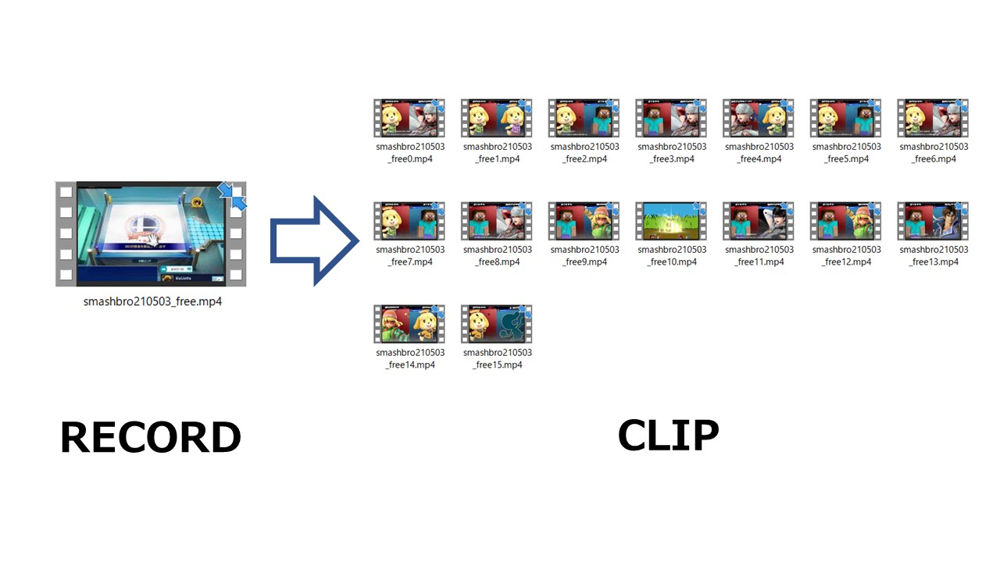
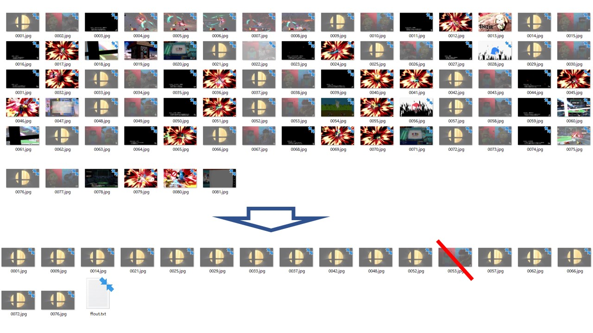
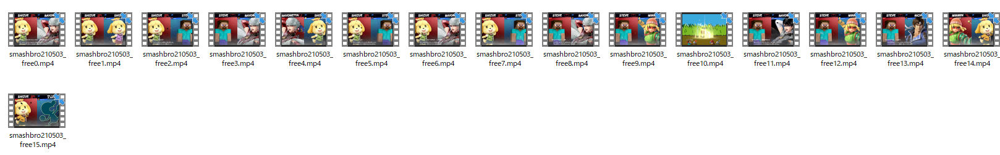

# SmashPlayClip_β

長時間のスマブラ動画アーカイブから試合開始の瞬間を検出し、半自動で1本の動画から複数の対戦動画を分割し再出力するプログラムです。

# 概要

長時間の録画データを編集することが面倒くさい方向けです。

試合開始の瞬間をとらえて次の試合の開始までを切り取ります。試合終了の瞬間は検出していないので試合だけを完璧に切り取ってはいません。あくまで補助的なものだと考えてください。



シーン検出についてはAverageHashアルゴリズムをもとに実装しました。

# 動作確認環境

* OS Windows10 powerShell
* Python 3.9.4
* FFmpeg

# 実装

## PowerShellの設定

PowerShellを使うと場合セキュリティポリシーが無効になっている場合があります。設定を変更し許可してください。

設定変更参考: [このシステムではスクリプトの実行が無効になっているため、ファイル *スクリプトファイル名* を読み込むことができません。](https://www.curict.com/item/d1/d1c4a3e.html)

## Pythonの設定

PowerShellでPythonが実行可能であることを確認してください。

Pythonの導入参考: [Windows版Pythonのインストール](https://www.python.jp/install/windows/py_launcher.html)

Pythonに必要ライブラリのインストールをしてください。
```txt
pip install opencv-contrib-python
pip install ImageHash
pip install Pillow
```
## FFmpegの設定

FFmpegのインストールと環境設定を行います。PowerShell上で実行可能であることを確認してください。

参考: [FFmpegのインストール手順と使い方(Windows)](https://jbjbgame.com/post-5568/)

# 使い方

フォルダ階層は以下の通りです。

```text
.
└── movie
    └── xxx.mp4
   (└── xxx)
        (└── xxxn.mp4)
└── output
   (└── xxx)
       (└── nnnn.jpg)
       (└── ffout.txt)
└── positive_data
    └── pdata_00xx.jpg
        ...
└── command.ps1
└── get_gamestart_img.py
└── get_scene_movie.py
└── mylist.txt
```

1. 分割したい動画を `movie` に配置してください。その後以下のコマンドをPowerShellに入力します。

```powershell
> .\command.ps1 .\movie\xxx.mp4
```

2. 実行するとoutputにフォルダが出力され、動画全体からシーン切り替わり検出の結果が出力されます。

3. その後positive_data内にある画像と類似した画像のみが分類されます。

4. ここで `output\xxx\` 内にある不要なデータを削除します。



5. その後PowerShell内の指示に従い `y` を押すことで `movie` に分割された動画が出力されます。



6. output内のフォルダは削除されます。出力した動画ファイルは `mylist.txt` に記録されます。


# 注意

* 当リポジトリは個人が公開した非公式の配布プログラムです。任天堂株式会社様、他関連企業様とは一切関係ありません。

* プログラムの編集は個人の責任で行ってください。画像データについては二次配布は禁止します。

* 今後予告なくこのリポジトリは削除される可能性があります。

# 参考

[FFmpegで動画の要らないシーンを削除する～シーン検出とサムネイル画像出力～](https://qiita.com/otakoma/items/842b7417b1012fab9097)
